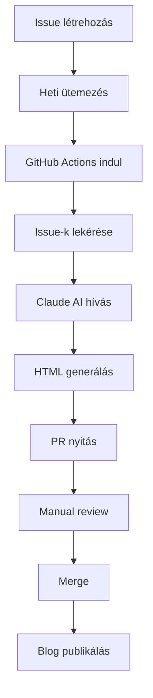

# 🤖 Automatizált Blog Content Rendszer

## 📋 Áttekintés

Ez a rendszer automatikusan generál SEO-optimalizált blog cikkeket GitHub Issues-ből Claude AI-val. 

**URL Struktúra:** `blog/{slug}`

## 🚀 Hogyan Működik

### 1. Issue Létrehozás
- Menj a **Issues** tab-ra
- Kattints **New Issue**
- Válaszd a **📝 Blog Post Request** template-t
- Töltsd ki a űrlapot

### 2. Automatikus Feldolgozás
- **Ütemezés:** Hétfő, Szerda, Péntek 09:00 (CET)
- **GitHub Actions** automatikusan feldolgozza a `blog:generate` label-lel jelölt Issue-kat
- **Claude AI** generálja a teljes HTML cikket
- **Pull Request** nyílik review-hoz

### 3. Review és Publikálás
- Ellenőrizd a generált tartalmat
- Merge-eld a PR-t
- A cikk automatikusan elérhető: `blog/{slug}`

## 📁 Fájl Struktúra

```
blog/
├── {slug}.html              # Generált blog cikkek
├── annual-content-production-plan.md  # Éves tartalom terv
└── README.md               # Ez a dokumentáció

.github/
├── ISSUE_TEMPLATE/
│   └── blog_request.yml    # Issue sablon
└── workflows/
    └── content-generator.yml  # Automatizáló workflow

scripts/
└── generate-blog.js        # Blog generátor script
```

## ⚙️ Beállítások

### Szükséges GitHub Secrets
1. **Repository Settings** → **Secrets and Variables** → **Actions**
2. Hozd létre: `ANTHROPIC_API_KEY`
3. Add meg a Claude API kulcsodat

### API Kulcs Beszerzése
1. Menj az [Anthropic Console](https://console.anthropic.com/)-ra
2. Hozz létre API kulcsot
3. Másold be a GitHub Secrets-be

## 📝 Blog Post Típusok

### 🌍 Local Angles (4 típus)
1. **Best-Fit Briefs** - "Ki a legjobb..."
2. **Top Reasons Series** - "Miért válassza..."
3. **Service/City Posts** - "Legjobb [szolgáltatás] [helyszínen]"
4. **Service Comparisons** - "Összehasonlítás"

### 🎯 Topical Authority (20 típus)
- Mistakes, Step-by-Step, Case Study
- Beginner's Guide, FAQ, Solutions
- Industry Stats, Trends, Myths
- Quick Tips, Expert Opinion, stb.

## 🎨 Content Követelmények

### SEO Elemek
- ✅ Meta Title (60 karakter max)
- ✅ Meta Description (160 karakter max)  
- ✅ H1-H3 struktúra
- ✅ JSON-LD Schema markup
- ✅ Belső linkek (5-8 db)
- ✅ Target keywords optimalizáció

### Brand Voice
- ✅ ProStone Megoldások branding
- ✅ 25+ év tapasztalat hangsúlyozás
- ✅ Helyi szakértelem (Budapest/Pest megye)
- ✅ Szakértői, de érthető nyelv
- ✅ Konkrét példák és referenciák

## 📊 Monitoring

### GitHub Actions Logs
- **Actions** tab → **Automatic Blog Content Generator**
- Részletes log minden futásról
- Hiba esetén email értesítés

### Issue Tracking
- Feldolgozott Issue-k automatikusan `processed` label-t kapnak
- Zárt Issue-kban komment az eredményről
- Hiba esetén error komment

## 🔄 Workflow Folyamat



## 🛠️ Hibaelhárítás

### Gyakori Problémák

**1. "No ANTHROPIC_API_KEY"**
- Ellenőrizd hogy a Secret be van állítva
- API kulcs még érvényes

**2. "No open issues found"**  
- Ellenőrizd hogy Issue-n rajta van a `blog:generate` label
- Issue státusz `open`

**3. "Claude API error"**
- Rate limiting - várj és próbálj újra
- API kulcs kvóta ellenőrzése

**4. "Blog post already exists"**
- Ugyanaz a slug már létezik
- Módosítsd a slug mezőt az Issue-ban

### Manual Futtatás

1. **Actions** tab → **Automatic Blog Content Generator**
2. **Run workflow** → **Manual trigger**
3. Beállítsd a max posts számot

## 📈 Teljesítmény

### Generálás Sebessége
- **1 cikk:** ~30-60 másodperc
- **Rate limit:** 2 másodperc delay cikkek között
- **Max/futás:** 2-3 cikk (konfiguálható)

### AI Model
- **Claude 3.5 Sonnet** (legfrissebb)
- **4000 token limit** (~3000 szó)
- **Magyar nyelvű** optimalizáció

## 🎯 Éves Terv

Lásd: [`annual-content-production-plan.md`](./annual-content-production-plan.md)

- **180 cikk/év** target
- **500+ service+location kombináció**
- **AI SEO dominancia** ChatGPT, Perplexity, Gemini

## 🔗 Hasznos Linkek

- [GitHub Actions Dokumentáció](https://docs.github.com/en/actions)
- [Anthropic Claude API](https://docs.anthropic.com/)
- [SEO Best Practices](https://developers.google.com/search)
- [JSON-LD Schema](https://schema.org/)

---

## 🆘 Support

Ha problémád van:
1. Ellenőrizd a **GitHub Actions logs**-ot
2. Nézd meg a **Issues** tab-ot hiba kommentekért  
3. Ellenőrizd hogy minden **Secret** be van állítva
4. Manual futtatás tesztelése

**URL Pattern:** `https://domain.hu/blog/{slug}`